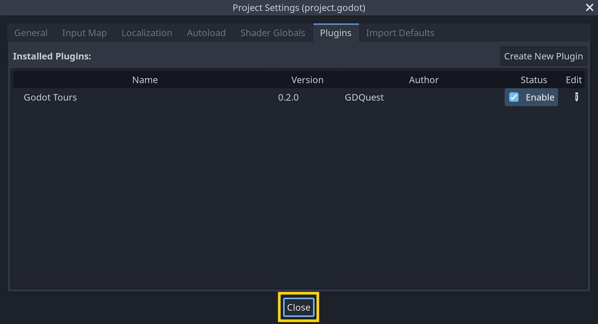

# Godot Tours: 101 - The Godot Editor

A free and open-source tour using the [Godot Tours](https://github.com/GDQuest/godot-tours/) add-on.

If you're new to gamedev and you want to download the tour and run it, head over to the [GDQuest website](http://gdquest.com/tutorial/godot/learning-paths/godot-tours-101/) for detailed instructions.

**Minimum required Godot version: Godot 4.2 standard** (*not* the .NET edition)

## Activating the Godot Tours plugin

To activate the Godot Tours plugin and run the tour, follow these steps:

1. Locate the drop-down menus at the top left of the editor.

    

2. Click on *Project -> Project Settings...*

    

3. A pop-up window opens. Click on the *Plugins* tab.

    

4. The tab lists plugins that are available in the project. Notice the empty check box to the right of the Godot Tours plugin. Click the checkbox to enable the plugin.

    

Shortly after enabling the plugin, you should see the editor dim down behind the window. Click the *Close* button at the bottom of the Project Settings window to close it.

You will see a menu listing the tours available in the project.

Click the first tour in the menu to select it (*101: The Godot Editor*), and then click the *START LEARNING* button at the bottom to get started.

## Support and contributions

Given our limited resources and the work this project represents, it is provided as-is. We hope it will be helpful to you, but we can't offer individual support for it.

Except for bug fixes, we will generally not accept contributions to this tour. If you'd like to create a different tour based on this one, please feel free to fork the project.

Note that any code change or bug related to the `godot_tours` add-on itself should be submitted to the [Godot Tours repository](https://github.com/GDQuest/godot-tours/) instead.

